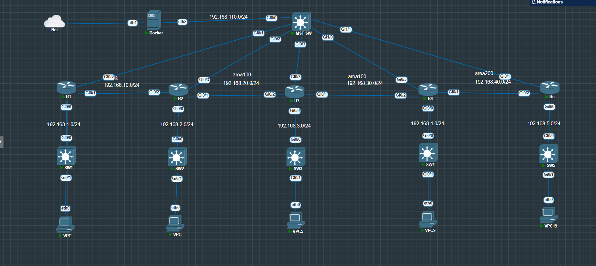

# Automating Multi-Area OSPF Deployment with Ansible & EVE-NG

[](https://www.ansible.com/)
[](https://www.cisco.com/)
[](https://github.com/topics/network-automation)

An enterprise-ready Ansible playbook designed to automate the configuration and deployment of Cisco IOS routers and switches simulated inside **EVE-NG** (Emulated Virtual Environment - Next Generation). This repository demonstrates modern Network Infrastructure as Code (IaC) principles to manage Layer 2 and Layer 3 topologies, routing protocols (specifically Multi-Area OSPF), tunnel interfaces, and DHCP services dynamically using data-driven Ansible roles.

---

## 📌 Project Overview & Topology

This automation project targets a multi-node Cisco IOS topology (routers `R1-R5` and switches `SW1-SW5`), configuring core network functions dynamically based on structured variable files.

### 🖼️ Network Topology Screenshot

The following diagram illustrates the structural connection flow, VLAN distributions, OSPF Areas (Area 0, Area 100, Area 200), and point-to-point GRE tunnel links configured by this playbook:



### Key Features Automated
*   **System Identity:** Standardized hostname configuration across all managed nodes.
*   **Layer 2 Switched Infrastructure:**
    *   Dynamic VLAN creation and provisioning (`10: IT`, `20: HR`, `30: FINANCE`, `40: HUMAN_RESOURCE`, `50: WIFI`, `60: SERVICE`).
    *   Switchport configuration for both **Access** and **802.1Q Trunk** modes.
    *   Spanning-Tree optimization using **Rapid-PVST** (Rapid Per-VLAN Spanning Tree).
*   **Layer 3 Routed Infrastructure:**
    *   IPv4 address provisioning for physical router interfaces.
    *   **802.1Q VLAN Subinterfaces** (Router-on-a-Stick setup) with encapsulation.
    *   Point-to-point **GRE/Virtual Tunnel Interfaces** configuration (e.g. Tunnel1 between `R2` and `R4`).
*   **Core IP Services:**
    *   DHCP service deployment: configuration of excluded address ranges, IP pools, default gateways, lease durations, and DNS servers.
*   **Dynamic Routing (OSPF):**
    *   Multi-area OSPF routing configuration (OSPF Process ID, Router ID, network statements with wildcards, and area assignments across Areas 0, 100, and 200).
*   **State Persistence:** Automatic configuration saving (`write memory` / `copy running-config startup-config`) on all nodes.

---

## 📂 Project Structure

```directory
ospf/
├── host.ini               # Inventory file listing target routers and switches with connection details
├── site.yml               # Main master playbook coordinating roles across hosts
├── requirements.yml       # Ansible Galaxy collection dependencies
├── screenshot/            # Directory containing topology diagrams/verification screenshots
│   └── image.png          # Main topology screenshot
└── roles/
    ├── router_config/     # Role dedicated to L3 Router Configurations (IPs, Subinterfaces, DHCP, Tunneling, OSPF)
    │   ├── tasks/
    │   │   └── main.yml   # L3 configuration tasks
    │   └── vars/          # Structured YAML data definitions for interfaces, IPs, OSPF, DHCP, etc.
    │       ├── assin_ip_add_interface.yml
    │       ├── dhcp_ip_pools_router_vlans.yml
    │       ├── router_Vlan_subinterface.yml
    │       ├── router_to_sw_interfaces.yml
    │       ├── tunnel_interface_config.yml
    │       └── ospf.yml
    └── switch_config/     # Role dedicated to L2 Switch Configurations (VLANs, Access, Trunking, STP)
        └── tasks/
            └── main.yml   # L2 configuration tasks
        └── vars/
            └── main.yml   # Structured VLAN definitions and port maps
```

---

## 🛠️ Prerequisites & Setup

### 1. Requirements
Ensure you have the following installed on your control node:
*   Python 3.9+
*   Ansible Core 2.12+
*   Ansible Cisco.IOS Collection (v4.0.0 or higher)

### 2. Install Required Collections
Install the Cisco IOS collection required by the playbook using the `requirements.yml` file:
```bash
ansible-galaxy collection install -r requirements.yml
```

### 3. Inventory Details (`host.ini`)
The inventory specifies the IP address, credentials, and connection methods for all devices using the `ansible.netcommon.network_cli` connection plugin:
```ini
[routers]
R1 ansible_host=192.168.110.21
R2 ansible_host=192.168.110.22
R3 ansible_host=192.168.110.23
R4 ansible_host=192.168.110.24
R5 ansible_host=192.168.110.25

[switches]
SW1 ansible_host=192.168.20.21
SW2 ansible_host=192.168.20.22
SW3 ansible_host=192.168.20.23
SW4 ansible_host=192.168.20.24
SW5 ansible_host=192.168.20.25

[cisco:vars]
ansible_connection=ansible.netcommon.network_cli
ansible_network_os=cisco.ios.ios
ansible_user=admin
ansible_password=cisco123
ansible_become=yes
ansible_become_method=enable
ansible_become_password=cisco123
ansible_ssh_timeout=120
ansible_command_timeout=120
```

---

## 🚀 How to Run the Playbook

To deploy the entire network configuration across all routers and switches, run the following command:

```bash
ansible-playbook -i host.ini site.yml
```

### Run Specific Tasks Using Limits
If you wish to configure only routers or only switches, you can limit the execution:
```bash
# Configure routers only
ansible-playbook -i host.ini site.yml --limit routers

# Configure switches only
ansible-playbook -i host.ini site.yml --limit switches
```

---

## ⚙️ Configuration Variables Structure

Configurations are fully decoupled from task logic using variables located in the `vars/` directory of each role.

### Router Variables Example (`roles/router_config/vars/ospf.yml`):
```yaml
ospf_config:
  R2:
    process_id: 1
    router_id: 2.2.2.2
    networks:
      - network: 192.168.10.0
        wildcard: 0.0.0.255
        area: 0
      - network: 192.168.20.0
        wildcard: 0.0.0.255
        area: 100
```

### GRE Tunnel Variables Example (`roles/router_config/vars/tunnel_interface_config.yml`):
```yaml
tunnel_interface_config:
  R2:
    - name: tunnel1
      ip_address : 192.168.100.1
      netmask: 255.255.255.0
      tunnel_source : g0/1
      tunnel_destination: 192.168.30.2
```

### Switch Variables Example (`roles/switch_config/vars/main.yml`):
```yaml
vlans:
  - vlan_id: 10
    name: IT
  - vlan_id: 20
    name: HR

switch_interfaces:
  - name: GigabitEthernet0/0
    mode: trunk
    description: TRUNK_TO_ROUTER
    allowed_vlans: "10,20,30,40,50"
    trunk_native_vlan: 1

  - name: GigabitEthernet0/1
    mode: access
    description: ACCESS_PORT_VLAN10
    access_vlan: 10
```

---

## 🔍 Verification & Troubleshooting

Once the playbook execution is complete, verify the state of your Cisco IOS devices with these commands:

### 1. Verify Layer 2 Switching
*   **VLAN Assignment Check:**
    ```ios
    show vlan brief
    ```
*   **Trunk Status Check:**
    ```ios
    show interfaces trunk
    ```
*   **Spanning Tree Status:**
    ```ios
    show spanning-tree summary
    ```

### 2. Verify Layer 3 & Dynamic Routing
*   **Interface IP Verification:**
    ```ios
    show ip interface brief
    ```
*   **OSPF Neighbors Verification:**
    ```ios
    show ip ospf neighbor
    ```
*   **Route Table Check:**
    ```ios
    show ip route ospf
    ```
*   **GRE Tunnel Verification:**
    ```ios
    ping 192.168.100.2
    ```

---

## 🤝 Contributing
Contributions, issues, and feature requests are welcome! Feel free to check the issues page or submit a pull request.
